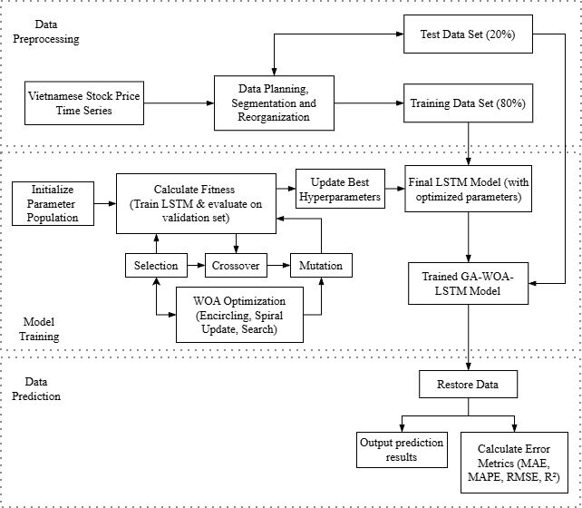

# GA-WOA-LSTM 📈

Mô hình **GA-WOA-LSTM** là framework kết hợp **Genetic Algorithm (GA)** + **Whale Optimization Algorithm (WOA)** để tối ưu hyperparameter cho mạng **LSTM**, phục vụ dự báo giá cổ phiếu Việt Nam.

---

## 🔄 Quy trình tổng quát



*(Sao chép ảnh luồng bạn gửi vào thư mục `images/` và đặt tên là `flowchart.png` để README hiển thị đúng.)*

---

## 📌 Mục tiêu

* Tối ưu hyperparameter LSTM bằng chiến lược lai GA + WOA.
* Dự báo giá đóng cửa cổ phiếu (VIC, HPG, DPM).
* So sánh với các mô hình chuẩn: LSTM, GA‑LSTM, WOA‑LSTM, RNN, CNN, BP.

---

## 🧰 Công nghệ

* Python 3.8+
* TensorFlow / Keras
* pandas, numpy, scikit‑learn
* yfinance
* matplotlib

---

## 📂 Cấu trúc project

```
GA-WOA-LSTM/
├─ crawl_data.py
├─ data_preprocessing.py
├─ GA-WOA-LSTM.py
├─ GA-LSTM.py
├─ WOA-LSTM.py
├─ LSTM.py
├─ RNN.py
├─ CNN.py
├─ BP.py
└─ images/
   └─ flowchart.png
```

---

## ⚡ Cách chạy nhanh

### 1. Cài thư viện

```bash
pip install yfinance pandas numpy scikit-learn matplotlib tensorflow
```

### 2. Crawl dữ liệu VIC, HPG, DPM

```bash
python crawl_data.py
```

### 3. Huấn luyện mô hình GA‑WOA‑LSTM

```bash
python GA-WOA-LSTM.py
```

---

## 📊 Đánh giá

Mô hình được đánh giá bằng các chỉ số:

* MAE
* RMSE
* MAPE
* R²

Tập dữ liệu được chia:

* 80% Training
* 20% Testing

---

## 📝 License

MIT License

---

Nguyễn Thành Nhật
